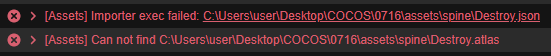
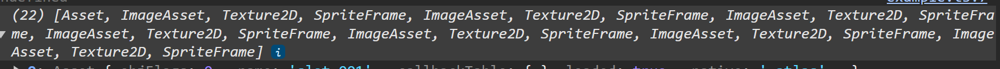
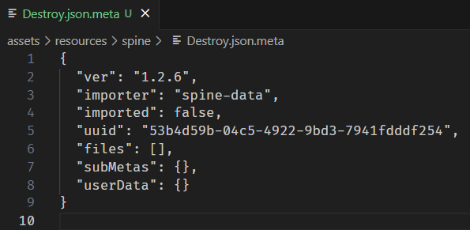
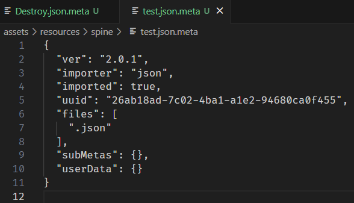
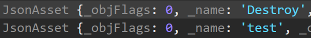
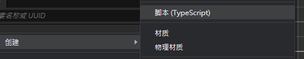
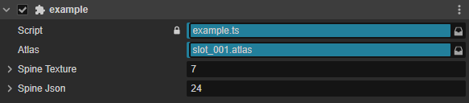

+++
author = "Roy Liu"
title = "Cocos - Spine多骨架多圖集問題"
date = "2024-07-16"
description = "如何在Cocos中使用多骨架多圖集Spine的方式。"
tags = [
  "Cocos", "Spine"
]
categories = [
    "Game Engine",
]
series = ["Cocos"]
# aliases = ["migrate-from-jekyl"]
image = "cocos-logo.jpg"
+++

## Cocos & Spine

以前碰過 Egret(倒了, 好慘, 不然是用得最順手 QQ), LayaAir。這次臨危受命來碰 Cocos。

今天遇到了一個問題，以前的經驗來說，美術在輸出 Spine 檔都是 1json, 1atlas, 1png。
這次合作的大大給的卻是 N 個 json, 1atlas, M 個 png。

一時間令我困惑不已，詢問之下是因為 Draw Call 的考量。(而這又是另外一個故事了)。
由於是為了效能考量，我也只能摸摸鼻子開始 GOOGLE 解決辦法，然而卻 GOOGLE 了寂寞。

首先就遇到了開頭的問題，Cocos 默認就是 1json : 1atlas : 1png，燈愣，無法直接在編輯器中使用。



好吧！那只能試試從 code 方面下手了。

### resources.loadDir

```javascript
resources.loadDir("spine", (err, data) => console.log(err, data));
```

來，先來瞧瞧有沒有辦法 load 出檔案。



看著看著好像哪裡不太對阿！我的 json 呢？ 怎麼通通都沒有！Cocos 啊！
後續又試了下面幾種 load

### assetManager.load

```javascript
    assetManager.loadBundle 0分 (也有可能是我不會用，畢竟剛接觸)
    assetManager.loadRemote 60分
    assetManager.loadAny 60分
```

loadRemote 跟 loadAny 當下看起來是有點搞頭。但我沒找到 Cocos 的 remote 檔案到底要放哪裡，所以要用的話只能另外起 server，
只是這對本地開發感覺十分不友善，想了想還是算了。(後續有做測試，loadRemote, loadAny 確實有搞頭，也比後來我使用的方式正規，
但在找不到方法包進本地資料夾的情況下，我覺得沒有很優。)

### cocos meta 檔

由於以上較為正規的方式都測試過了，只好想想不那麼正規的測試。直覺告訴我應該跟 Cocos 產的 meta 檔有關。那麼首先就來瞧瞧它。



這麼一瞧，我想大概是 importer 的問題，那我就來看看正常的 json 長什麼樣子。



哦齁！importer 是 json 而不是 spine-data！那我們就先把 importer 硬改看看吧!



燈愣！成功 load 了！雖然方法不那麼正規，但頂多就寫個批次檔來處理就是了，不然 VSC 直接搜尋取代也是很迅速。好的那麼接下來就是測試能否創建 Spine 了！

## 創建 Spine

首先呢，先從 IDE 右鍵創建 Script



### code 寫一下

```javascript
@ccclass("example")
export class example extends Component {
  @property(Asset)
  public spineAtlas: Asset = null;
  @property(Texture2D)
  public spineTexture: Texture2D[] = [];
  @property([JsonAsset])
  public spineJson: JsonAsset[] = [];

  start() {
    const spine = new Node();
    spine.addComponent(UITransform);
    spine.addComponent(sp.Skeleton);
    const skeletonData = new sp.SkeletonData();
    skeletonData.skeletonJson = this.spineJson[0].json as sp.spine.SkeletonJson;
    skeletonData.atlasText = this.spineAtlas.nativeAsset;
    skeletonData.textures = this.spineTexture;
    skeletonData.textureNames = [""]; // 不太確定用意 測起來有跟沒有都不影響
    const skeleton: sp.Skeleton = spine.getComponent(sp.Skeleton);
    skeleton.skeletonData = skeletonData;
    this.node.addChild(spine);
    skeleton.animation = "anim_1"
  }
}
```

### 掛上 Custom Script



### 畫面

燈愣！沒有問題！可喜可賀！還好順利解決問題了！


## 結語

在 Google 的時候不只有我一個人有這問題，但沒看到什麼有用的解法，唯一有看到的是用 loadRemote 處理但也沒有寫得很清楚，遇到的問題就是上述提及的。
也問了 Chatgpt 結果回了正常 1json : 1atlas : 1png 的用法，我也是無奈。

希望 Cocos 後續優化可以在 IDE 上自由選擇 Spine 動畫的組成結構，而不是由名字來自動抓取。
雖然不確定是不為了避免發生上述 Draw Call 的小故事(下集待續)。
但多少覺得有些障礙。或是讓 resources.loadDir 可以正確讀取到檔案也是個折衷的辦法。

最後，好想知道 Cocos 起 server 用的資料夾到底在哪阿！
